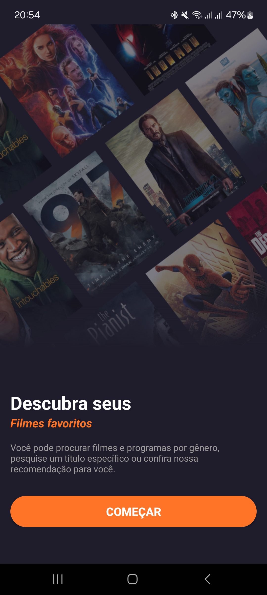
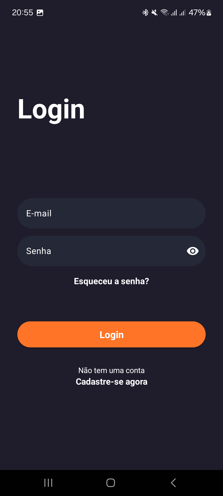
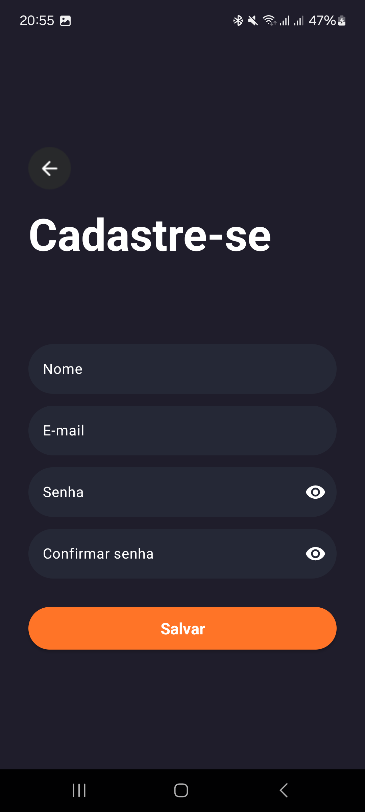

# TMDB App

O **TMDB App** é um aplicativo para Android que utiliza a API do The Movie Database (TMDb) para apresentar informações sobre filmes populares, além de permitir a busca por títulos específicos, criação e autenticação de usuários com firebase. Este projeto foi desenvolvido com o objetivo de consolidar conhecimentos sobre consumo de APIs, arquitetura MVVM, injeção de dependências, firabase e boas práticas de desenvolvimento.

---

## Funcionalidades
- **Lista de filmes:** Exibe listas de filmes populares, bem avaliados e que estão por vir, com base nos dados da TMDb.
- **Pesquisa de filmes:** Permite pesquisar por títulos específicos.
- **Detalhes do filme:** Apresenta informações detalhadas de cada filme, incluindo sinopse, elenco, generos e avaliação.
- **Favoritos:** Opção para marcar filmes como favoritos e acessá-los facilmente na área "Meus favoritos", armazenados no firebase.
- **Autenticação de usuários:** Criação e autenticação de usuários utilizando Firebase.

---

## Capturas de Tela
<p>




</p>

## Tecnologias e conhecimentos exercidos:
- **Linguagem:** Kotlin
- **Arquitetura:** MVVM (Model-View-ViewModel) + Clean Architecture
- **Coroutines**: Implementação de funções não sincronas.
- **Jetpack:** ViewModel & LiveData
- **Consumo de API:** Retrofit e OkHttp
- **Injeção de Dependência:** Hilt
- **Serviços em Nuvem:** Firebase (para autenticação e armazenamento de favoritos)
- **Bibliotecas Adicionais:**
  - Glide (para carregamento de imagens)
  - Ismaeldivita (bottom navigation)
  - Dimezis|BlurView (Implementação blurview na tela de detalhes)
---

## Instalação e Configuração

1. Clone o repositório:
   ```bash
   git clone https://github.com/RaulGoncalo/TMDB-App.git
   cd tmdb-app
   ```

2. Adicione a chave de API do site da TMDB ao arquivo `local.properties`:
   ```
   TMDB_API_KEY=your_api_key_here
   ```

3. Configure o Firebase no projeto:
   - Faça o download do arquivo `google-services.json` do console do Firebase.
   - Coloque o arquivo na pasta `app` do projeto.

4. Abra o projeto no Android Studio.

5. Sincronize o Gradle e execute o aplicativo no emulador ou dispositivo físico.

---

## Estrutura do Projeto

- **/data:** Camada de dados da aplicação, encontrando classes para acesso a dados (API), repositórios, DTOs e modelos de dados.
- **/presentation:** Contém as telas e componentes da interface do usuário. Armazenando também as ViewModels
- **/di:** Configuração das dependências com Hilt.
- **/domain:** Classes para as regras de negócios da aplicação, como UseCases, Interfaces de repositórios e sealed classes.

---

## Melhorias Futuras
- Implementação de filtros avançados (por gênero, data de lançamento, etc.).
- Testes unitários e de interface.
- Expansão das listas de filmes para tela de resultados
- Ajustes de interfaces e theme

---

## Contribuições
Contribuições são bem-vindas! Sinta-se à vontade!


